# Building-ResistAI-on-Atlas-Dataset-With-Bayesian-Hierarchical-Modeling-and-Causal-models-DAGs

# 🧬 ResistAI+ – AMR Stewardship Platform

**ResistAI** is a Streamlit-powered dashboard that transforms Pfizer’s ATLAS antimicrobial resistance (AMR) data into actionable insights for stewardship programs, policy-makers, and stakeholders. Explore data trends, perform statistical analysis, build predictive models, and forecast resistance dynamics through an interactive web interface.

Access app [here](https://resistaiplus.streamlit.app/)
---

## 📚 Table of Contents
- [Introduction](#introduction)
- [Key Features](#key-features)
- [Methodology & Workflow](#methodology--workflow)
- [Getting Started](#getting-started)
  - [Prerequisites](#prerequisites)
  - [Installation](#installation)
  - [Data Access](#data-access)
- [Usage](#usage)
  - [App Overview](#app-overview)
  - [Pages & Functionality](#pages--functionality)
- [Results & Impact](#results--impact)
- [Roadmap & Future Work](#roadmap--future-work)
- [Contributing](#contributing)
- [License](#license)
- [Acknowledgments](#acknowledgments)

---

## 🧠 Introduction

Antimicrobial Resistance (AMR) is one of the greatest threats to global health, rendering once-effective treatments like Cefixime increasingly powerless. **ResistAI+** is a cutting-edge Streamlit-based web application that transforms the fight against AMR by integrating causal machine learning, Bayesian statistical modeling, and time-series forecasting into one seamless, interactive platform. Leveraging Pfizer’s ATLAS dataset, ResistAI+ empowers clinicians, researchers, and policymakers with real-time, evidence-driven insights to understand resistance mechanisms, predict resistance status, and forecast future trends, enabling smarter, targeted interventions that can save lives.

---

## The Problem
The rise of antibiotic-resistant pathogens is accelerating. Traditional analytical tools struggle to:
1.	Integrate diverse demographic, bacterial, and resistance data in one place.
2.	Provide interpretable predictions of resistance risk, not just “black box” outputs.
3.	Forecast emerging resistance trends to inform preemptive policy action.
ResistAI+ directly addresses these gaps, turning complex AMR datasets into interactive, actionable intelligence.
---
## 🚀 Key Features

ResistAI+ is not just another AMR dashboard, it is a decision-support system.
It delivers five integrated capabilities that take the user from exploration to action:
1.	**Data Analysis**: Explore interactive, hover-enabled visualizations (Plotly) of demographic, bacterial, and resistance data, enriched with real-time observations, implications, and recommendations for clinical action.
2.	**Statistical Analysis**: Unlock Bayesian Hierarchical Modeling (BHM) insights with precomputed visualizations, uncovering spatial clusters and temporal shifts in resistance rates, with continent/year-level effects modeled for precision.
3.	**Train Model**: Build predictive models for any antibiotic–bacteria pair using nine classification algorithms (e.g., XGBoost, Random Forest, Logistic Regression). Enhance interpretability with DAG-based causal effect estimation via DoWhy, revealing which biological or contextual factors drive resistance.
4.	**Make a Forecast**: Anticipate resistance threats with Prophet-based forecasting of future resistance trends, helping governments and hospitals plan years ahead.
5.	**Make Prediction**: Generate real-time, condition-specific resistance predictions with 97% accuracy, backed by causal effect analysis that explains why resistance is likely.
---

## Innovation Highlights
1.	Causal Machine Learning at Scale: Goes beyond correlation, using Directed Acyclic Graphs (DAGs) to reveal cause-and-effect relationships between key treatments (Phenotype, Source, Country) and resistance outcomes.
2.	Clinical-Grade Performance: XGBoost delivers up to 97% accuracy with precision, recall, and F1-scores consistently above 96%.
3.	Dynamic Interpretability: Users not only get predictions but also see why they’re made, enabling trust in high-stakes clinical decisions.
4.	Global Insight, Local Action: Bayesian modeling identifies regional AMR hotspots, while forecasts prepare stakeholders for upcoming threats.
5.	Resilient to Sparse Data: Focuses on non-gene clinical and demographic features to overcome 90% missing gene data, ensuring robustness.

---
## 🔄 Methodology & Workflow

The ResistAI pipeline transforms raw AMR data into stewardship-ready insights through the following stages:
```
┌───────────────────────────────┐
│     ATLAS AMR Data Ingestion  │
└──────────────┬────────────────┘
               ↓
┌──────────────┴───────────────┐
│  Data Cleaning & Antibiotic  │
│     Subsetting (MIC-based)   │
└──────────────┬───────────────┘
               ↓
┌──────────────┴───────────────┐
│  Analytical Modules (via     │
│ Plotly & Bayesian Models)    │
│ – Demographics & Species     │
│ – BHM Statistical Mapping    │
└──────────────┬───────────────┘
               ↓
┌──────────────┴───────────────┐
│ ML Model Training & Causal   │
│ Modeling (DAGs, Classification) │
└──────────────┬───────────────┘
               ↓
┌──────────────┴───────────────┐
│ Time-Series Forecasting      │
│ (Prophet + Regressors)       │
└──────────────┬───────────────┘
               ↓
┌──────────────┴───────────────┐
│ Interactive Streamlit UI     │
│ – Visual Insights            │
│ – Forecasts & Predictions    │
│ – Downloadable Models        │
└──────────────────────────────┘
```

Each module is designed to support transparency, reproducibility, and stakeholder relevance.

---

## 🛠️ Getting Started

### 📦 Prerequisites
- Python 3.9 or later
- Recommended: set up a virtual environment (`venv`, `conda`)

### ⚙️ Installation

```bash
git clone https://github.com/SirImoleleAnthony/Building-ResistAI-on-Atlas-Dataset-With-Bayesian-Hierarchical-Modeling-and-Causal-models-DAGs-.git
cd Building-ResistAI-on-Atlas-Dataset-With-Bayesian-Hierarchical-Modeling-and-Causal-models-DAGs
pip install -r requirements.txt
```
### Run app
streamlit run app.py

---
## 📄 Pages & Functionality

- **Home** - Project overview, methodology, and call-to-action navigation
- **Data Analysis** - Demographic, species, and antibiotic resistance visualizations with insights
- **Statistical Analysis** - BHM-based visualizations including trends, hotspots, and MIC creep
- **Train Model** - Interface to train classification models with causal analysis and export
- **Make a Forecast** - Forecast MIC trajectories with Prophet, offering trend visualizations
- **Make Prediction**	- Predict susceptibility status, estimate causal effects, and share results
- **About** - Acknowledge contributors, data sources, and challenge details

---
## 📈 Results & Impact

**ResistAI delivers**:
- Data-driven AMR insights for effective stewardship.
- Geospatial and temporal resistance mapping to inform policy.
- Predictive modeling capabilities tailored to stakeholders’ needs.
- A collaborative platform for transparent analysis and decision-making.

**Bayesian Modelling of Antimicrobial Resistance: Change‑points, MIC Creep, and Policy‑Ready Signals**
Results from some selected antibiotics (Levofloxacin, Linezolid, and Meropenem)
- *Change-points*: The Bayesian Hierarchical Model (BHM) identified significant change-points in resistance trends.

  Levofloxacin Change-Points 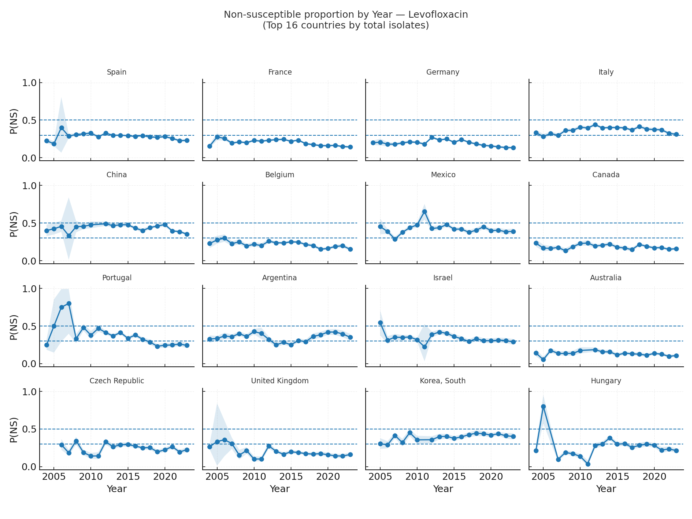

  Linezolid Change-Points 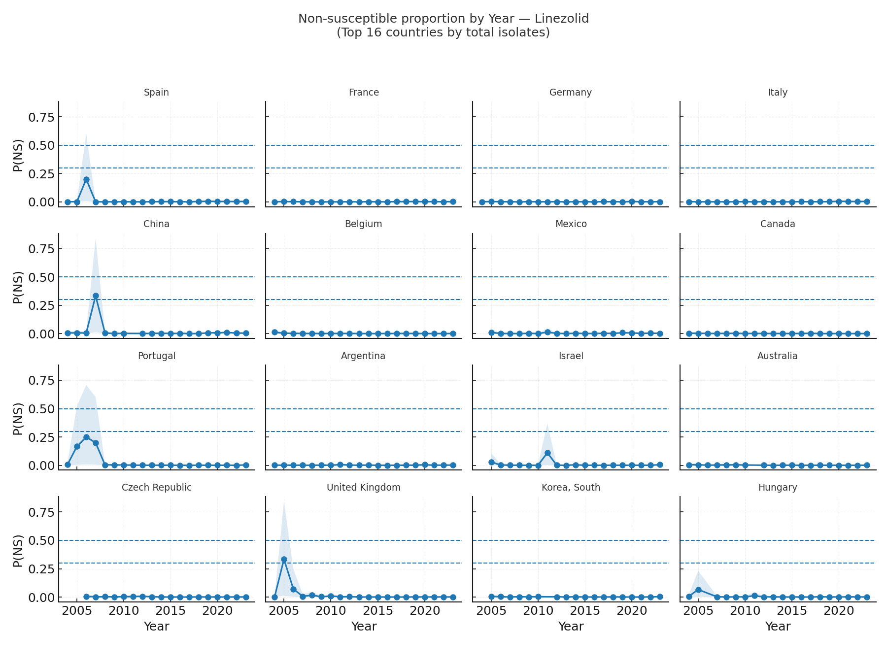

  Meropenem Change-Points 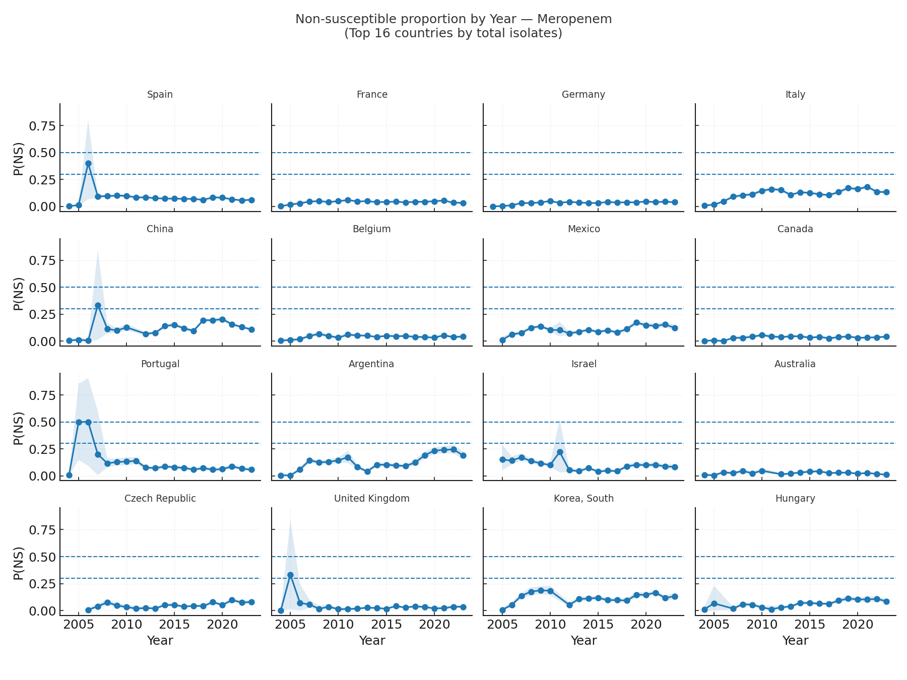

- *MIC Creep*: The BHM also detected MIC creep, indicating gradual increases in resistance levels over time.

  Levofloxacin MIC Creep for Top Hotspot Countries 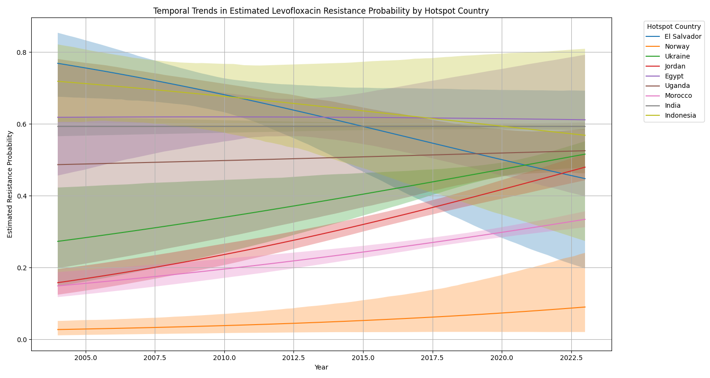

  Levofloxacin MIC Creep by Continents 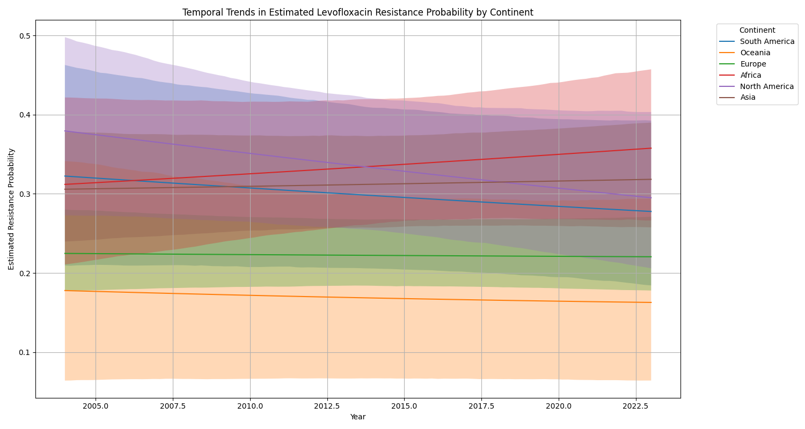

  Linezolid MIC Creep for Top Hotspot Countries 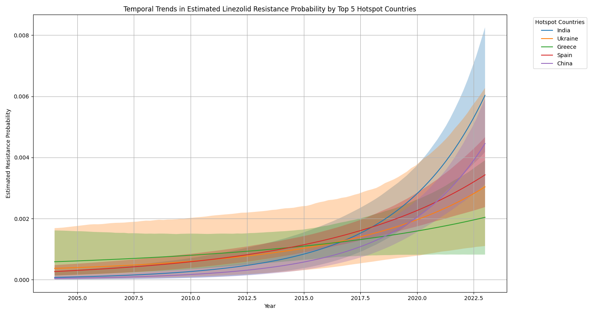

  Linezolid MIC Creep by Continent 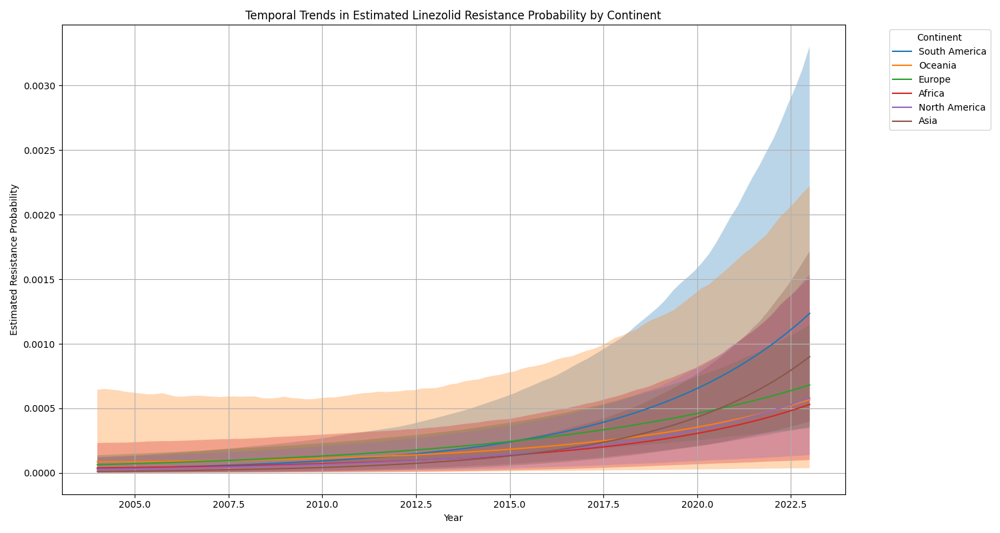

  Meropenem MIC Creep for Top Hotspot Countries 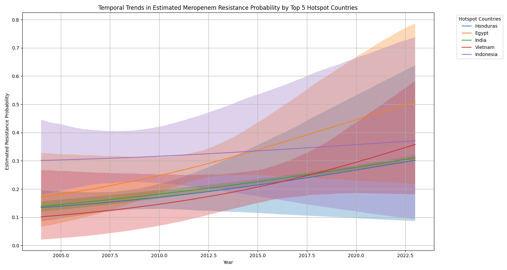

  Meropenem MIC Creep by Continent 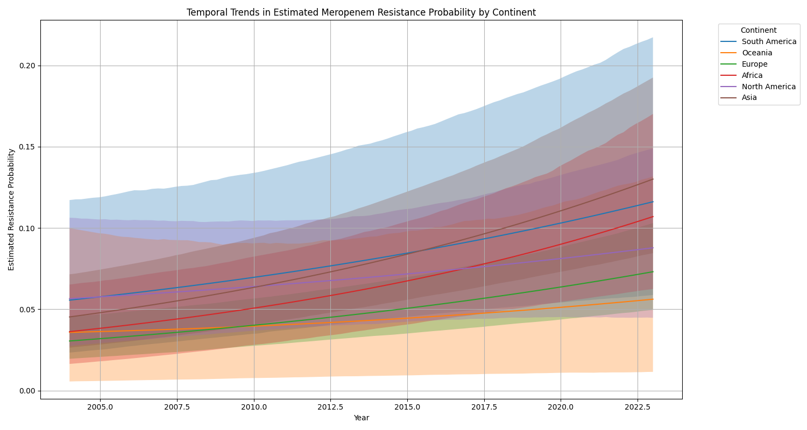

  - *Policy-Ready Signals*: The BHM results provide actionable insights for policymakers, highlighting areas of concern and potential interventions.
 
  Global-Positive Heatmap for Selected Organisms by Mechanism 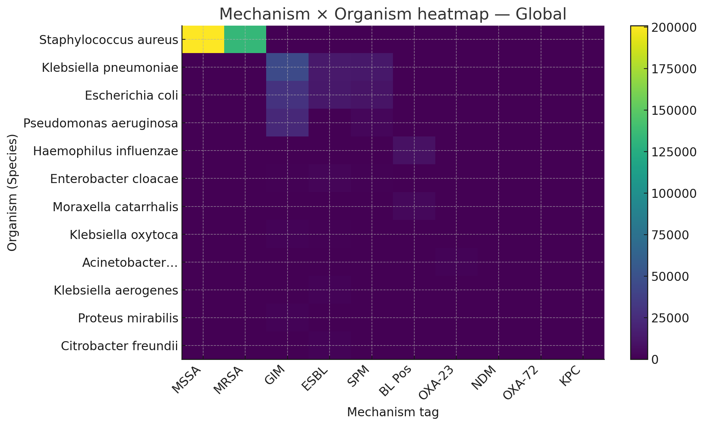

  Country Level Policy Priority for Selected Antibiotics 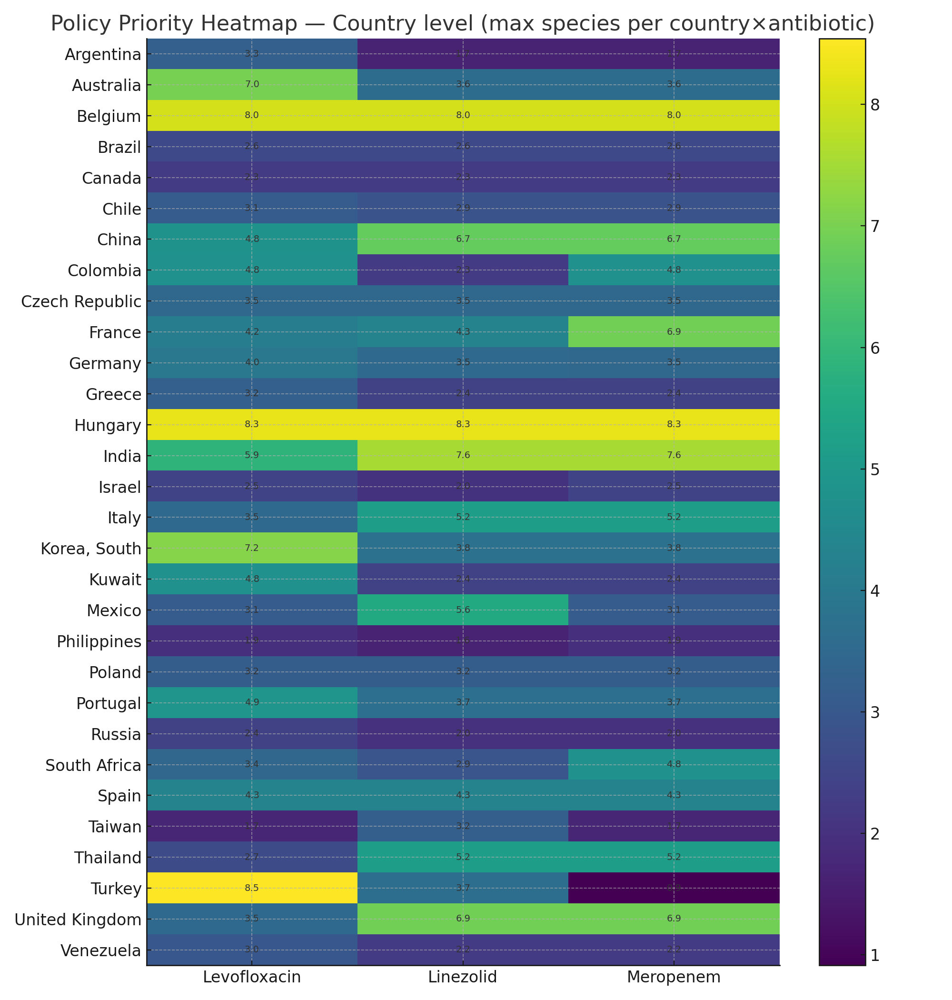

  - *NS by Year for Top 12 Countries*: The BHM results also include a summary of the number of samples (NS) by year for the top 12 countries, providing a comprehensive overview of resistance trends in _E. coli_.
 
  Levofloxacin NS by Year for _E. coli_ 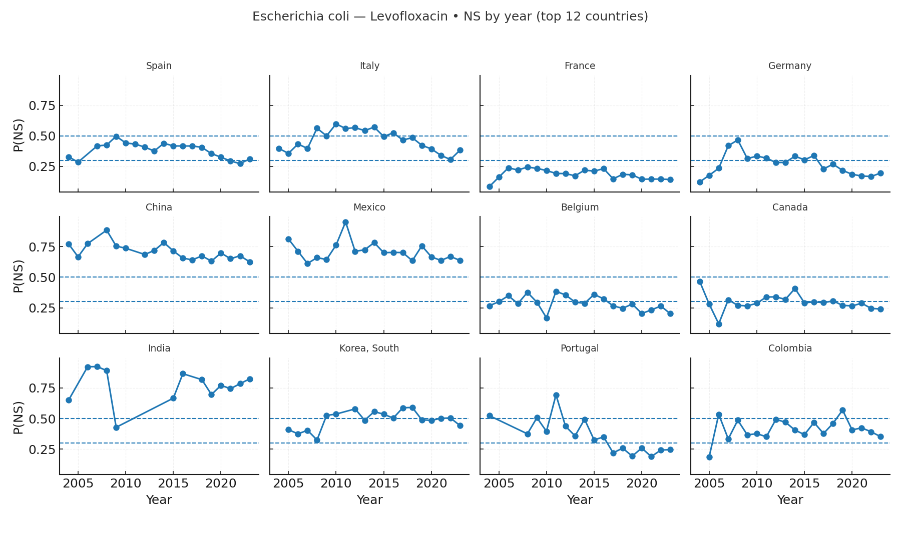

  Meropenem NS by Year for _E. coli_ 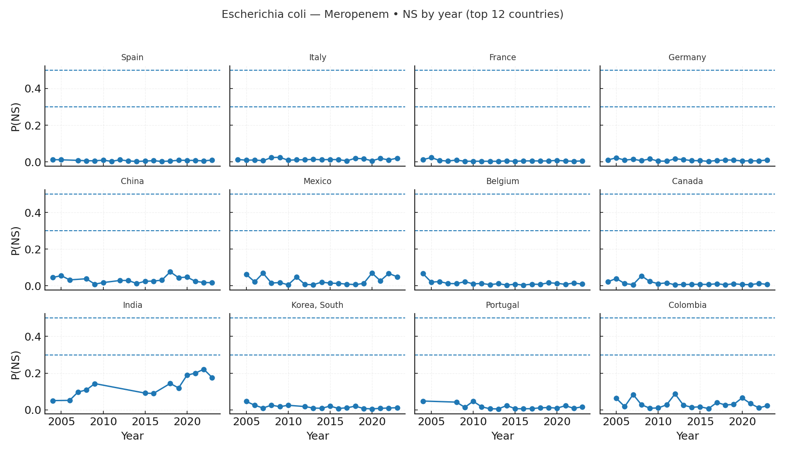
---

## 🧭 Roadmap & Future Work
- Incorporate genomic features and improve genetic data handling.
- Add multi-drug resistance forecasting and ensemble modeling.
- Enhance UI with dashboards, user onboarding, and multilingual support.
- Automate model retraining and deployment via CI/CD pipelines.
---

## 🤝 Contributing
This project is a submission for the 2025 Vivli AMR Surveillance Data Challenge. As such, external contributions are not required at this time. However, suggestions for enhancement, UI improvements, or stewardship-focused extensions are welcome via issues or discussions.
---
## 📄 License
This project is licensed under the MIT License.
---
## 🙏 Acknowledgments
- Pfizer ATLAS dataset – foundational AMR surveillance data
- Vivli AMR Surveillance Data Challenge 2025 – for inspiration and support
- Team members and contributors
    - Anthony Godswill Imolele - [LinkedIn](https://www.linkedin.com/in/godswill-anthony-850639199/)
    - Teye Richard Gamah - [LinkedIn](https://www.linkedin.com/in/gamah/)
    - Afolabi Owoloye - [LinkedIn](https://www.linkedin.com/in/afolabi-owoloye-a1b8a5b5/)
    - Kehinde Temitope Olubanjo - [LinkedIn](https://www.linkedin.com/in/temitope-kehinde/)
- Open-source libraries – Streamlit, Plotly, Prophet, XGBoost, PyMC, scikit-learn, pandas, etc.

**ResistAI**: _powering collaborative, actionable insights for antimicrobial resistance mitigation._
